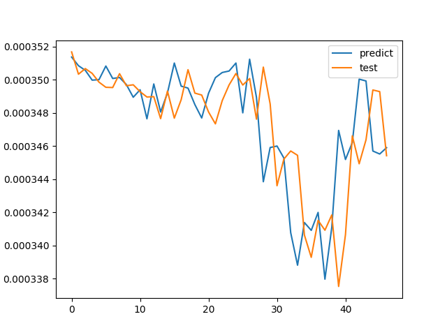

# Sample multiple variables predict price Cryptocurrencies

Python 3.6

## Libraries:
tensorflow: version 1.11

keras

h5py

sklearn

numpy

matplotlib

pandas

MySQLdb or mysqlclient


## Craw data
Config connect to MySQL: **config_db.py**

Run scrpit: historical_train.sql
```
python3 crawler_data_binance.py
```
## Train model 1 coin
```
python3 train.py -id [id_coin] -symbol [symbol]
```
Example:
```
python3 train.py -id 5 -symbol QTUMETH
```
Result: Save to database

<p align="center"></p>

## Train model mutil coin
```
python3 run.py
```

## Predict
```
python3 predict.py -id [id_coin] -symbol [symbol]
```

## Predict multi coin
```
python3 run_predict.py
```